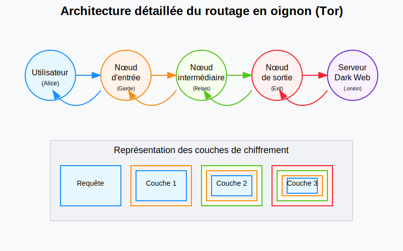

## 🇬🇧 [English](#en)
## 🇫🇷 Français 

# Le Dark Web : Guide complet et éducatif

## Introduction

Le Dark Web représente une partie fascinante et souvent mal comprise d'Internet. Contrairement au Web traditionnel que nous utilisons quotidiennement, le Dark Web n'est pas indexé par les moteurs de recherche classiques comme Google, Bing ou Yahoo. Il constitue une couche cachée du Web qui nécessite des outils spécifiques pour y accéder et y naviguer.

Ce guide vous propose une exploration approfondie du Dark Web, tant sur le plan théorique que pratique, pour comprendre ses principes fondamentaux, son fonctionnement technique, et ses implications dans notre société numérique.

## Fondements théoriques du Dark Web

### Structure en couches d'Internet

Pour comprendre le Dark Web, il est essentiel de visualiser Internet comme un système composé de plusieurs couches :

1. **Surface Web** : La partie visible et indexée par les moteurs de recherche traditionnels, représentant seulement 4-5% du contenu total d'Internet.
2. **Deep Web** : L'ensemble des contenus non indexés par les moteurs de recherche standards (bases de données privées, intranets d'entreprises, services nécessitant une authentification), représentant environ 90-95% d'Internet.
3. **Dark Web** : Une petite fraction du Deep Web qui nécessite des logiciels spécifiques pour y accéder, conçue pour l'anonymat et la confidentialité.

### Principes cryptographiques fondamentaux

Le Dark Web repose sur plusieurs principes cryptographiques essentiels :

- **Chiffrement asymétrique** : Utilisation de paires de clés (publique/privée) permettant d'établir des communications sécurisées sans échange préalable de clé secrète.
- **Chiffrement à plusieurs couches** : Principe du "routage en oignon" où chaque message est encapsulé dans plusieurs couches de chiffrement.
- **Séparation des connaissances** : Aucun nœud du réseau ne possède l'information complète sur un chemin de communication.

### Architecture de réseau distribué

Le Dark Web s'appuie sur une architecture décentralisée qui offre une résistance à la censure et aux attaques :

- **Absence de point central de défaillance** : Contrairement aux réseaux traditionnels, le fonctionnement ne dépend pas d'un serveur central.
- **Distribution géographique** : Les nœuds sont répartis mondialement, compliquant les tentatives de blocage par juridiction.
- **Redondance** : Les informations et chemins de routage sont dupliqués pour maintenir la disponibilité du réseau.

## Fonctionnement technique du Dark Web

### Le routage en oignon (Tor)

Le réseau Tor (The Onion Router) constitue la technologie la plus connue pour accéder au Dark Web. Son principe de fonctionnement, appelé routage en oignon, peut être détaillé comme suit :

#### Processus détaillé du routage en oignon

1. **Établissement du circuit** :
   - Le client Tor consulte un annuaire des nœuds disponibles
   - Il sélectionne aléatoirement trois nœuds (entrée, intermédiaire, sortie)
   - Un circuit cryptographique temporaire est établi avec ces nœuds

2. **Encapsulation des données** :
   - La requête initiale est chiffrée successivement avec les clés des trois nœuds
   - Chaque couche contient uniquement l'adresse du nœud suivant
   - Le message ressemble à un "oignon" avec plusieurs couches

3. **Transmission et décapsulation** :
   - Chaque nœud déchiffre une couche avec sa clé privée
   - Le nœud découvre uniquement l'adresse du prochain relais
   - Seul le nœud de sortie peut accéder au contenu final déchiffré

4. **Retour de la réponse** :
   - La réponse suit le même circuit en sens inverse
   - Chaque nœud ajoute une couche de chiffrement
   - L'utilisateur final déchiffre toutes les couches pour obtenir la réponse

### Les services cachés (.onion)

Les sites du Dark Web utilisent souvent le domaine de premier niveau `.onion` qui offre plusieurs caractéristiques uniques :

- **Anonymat bidirectionnel** : Non seulement l'utilisateur reste anonyme, mais l'emplacement physique du serveur est également masqué.
- **Adressage cryptographique** : Les adresses `.onion` sont dérivées de clés cryptographiques et se présentent sous forme de chaînes alphanumériques complexes.
- **Points de rendez-vous** : La communication entre clients et serveurs s'effectue via des points de rendez-vous intermédiaires, sans connexion directe.

### Autres technologies du Dark Web

Bien que Tor soit le plus connu, d'autres technologies permettent également d'accéder au Dark Web :

- **I2P (Invisible Internet Project)** : Réseau axé sur la communication interne avec un routage par "ail" (garlic routing), une variante avancée du routage en oignon.
- **Freenet** : Système distribué de stockage et de partage de fichiers résistant à la censure.
- **ZeroNet** : Réseau décentralisé de sites web hébergés par les utilisateurs eux-mêmes.

## Usages et implications du Dark Web

### Applications légitimes

Le Dark Web offre de nombreuses applications positives et légitimes :

- **Protection des lanceurs d'alerte** : Espace sécurisé pour partager des informations d'intérêt public sans risque de représailles.
- **Contournement de la censure** : Accès à l'information dans les pays pratiquant la censure d'Internet.
- **Communications sécurisées** : Protection des échanges sensibles pour journalistes, activistes, ou dissidents politiques.
- **Recherche académique** : Étude des technologies de confidentialité et des comportements en ligne.

### Activités illicites

Malheureusement, l'anonymat du Dark Web facilite également certaines activités criminelles :

- **Marchés noirs** : Vente de substances illicites, d'armes, ou de documents falsifiés.
- **Cybercriminalité** : Commerce de données volées, de logiciels malveillants, ou de services de piratage.
- **Contenus illégaux** : Diffusion de matériels interdits par les législations nationales.

### Considérations éthiques et sociales

Le Dark Web soulève d'importantes questions éthiques :

- **Équilibre vie privée/sécurité** : Comment concilier le droit légitime à la confidentialité avec la nécessité de lutter contre la criminalité ?
- **Neutralité technologique** : Les technologies d'anonymat sont-elles intrinsèquement bonnes ou mauvaises, ou leur valeur dépend-elle de leur utilisation ?
- **Fracture numérique** : L'accès au Dark Web crée-t-il une nouvelle forme d'inégalité entre les personnes techniquement informées et les autres ?

## Conclusion

Le Dark Web représente bien plus qu'un simple repaire d'activités illicites comme il est souvent dépeint. Il constitue une technologie complexe fondée sur des principes cryptographiques avancés, offrant des garanties de confidentialité essentielles dans notre ère numérique. Sa compréhension nécessite d'appréhender tant ses aspects techniques que ses implications éthiques et sociales.

Comme toute technologie puissante, le Dark Web n'est ni intrinsèquement bon ni mauvais — sa valeur dépend fondamentalement de l'usage qu'en font ses utilisateurs. Dans un monde où la surveillance de masse et la censure progressent, les technologies d'anonymat jouent un rôle crucial pour préserver certaines libertés fondamentales, tout en posant des défis significatifs aux autorités chargées de faire respecter la loi.

## Ressources pour approfondir

- Publications académiques sur la cryptographie et les réseaux anonymes
- Documentation technique du projet Tor et autres technologies similaires
- Études sociologiques sur les communautés du Dark Web
- Cadres juridiques relatifs à l'anonymat en ligne dans différentes juridictions

## 🇫🇷 Go to [French](#en)
## 🇬🇧 English 

# The Dark Web: Comprehensive Educational Guide

## Introduction

The Dark Web represents a fascinating and often misunderstood part of the Internet. Unlike the traditional Web we use daily, the Dark Web is not indexed by conventional search engines such as Google, Bing, or Yahoo. It constitutes a hidden layer of the Web that requires specific tools to access and navigate.

This guide offers an in-depth exploration of the Dark Web, both from theoretical and practical perspectives, to help you understand its fundamental principles, technical functioning, and implications in our digital society.

## Theoretical Foundations of the Dark Web

### Internet's Layered Structure

To understand the Dark Web, it's essential to visualize the Internet as a system composed of several layers:

1. **Surface Web**: The visible part indexed by traditional search engines, representing only 4-5% of the total Internet content.
2. **Deep Web**: All content not indexed by standard search engines (private databases, corporate intranets, services requiring authentication), representing approximately 90-95% of the Internet.
3. **Dark Web**: A small fraction of the Deep Web that requires specific software to access, designed for anonymity and confidentiality.

### Fundamental Cryptographic Principles

The Dark Web relies on several essential cryptographic principles:

- **Asymmetric Encryption**: Using key pairs (public/private) to establish secure communications without prior exchange of a secret key.
- **Multi-layer Encryption**: The principle of "onion routing" where each message is encapsulated in multiple layers of encryption.
- **Knowledge Separation**: No network node possesses complete information about a communication path.

### Distributed Network Architecture

The Dark Web relies on a decentralized architecture that offers resistance to censorship and attacks:

- **No Single Point of Failure**: Unlike traditional networks, operation doesn't depend on a central server.
- **Geographic Distribution**: Nodes are distributed worldwide, complicating blocking attempts by jurisdiction.
- **Redundancy**: Routing information and paths are duplicated to maintain network availability.

## Technical Operation of the Dark Web

### Onion Routing (Tor)

The Tor network (The Onion Router) is the most well-known technology for accessing the Dark Web. Its operating principle, called onion routing, can be detailed as follows:

#### Detailed Onion Routing Process

1. **Circuit Establishment**:
   - The Tor client consults a directory of available nodes
   - It randomly selects three nodes (entry, middle, exit)
   - A temporary cryptographic circuit is established with these nodes

2. **Data Encapsulation**:
   - The initial request is encrypted successively with the keys of the three nodes
   - Each layer contains only the address of the next node
   - The message resembles an "onion" with multiple layers

3. **Transmission and Decapsulation**:
   - Each node decrypts a layer with its private key
   - The node discovers only the address of the next relay
   - Only the exit node can access the final decrypted content

4. **Response Return**:
   - The response follows the same circuit in reverse
   - Each node adds a layer of encryption
   - The end user decrypts all layers to obtain the response

### Hidden Services (.onion)

Dark Web sites often use the top-level domain `.onion` which offers several unique characteristics:

- **Bidirectional Anonymity**: Not only does the user remain anonymous, but the physical location of the server is also hidden.
- **Cryptographic Addressing**: `.onion` addresses are derived from cryptographic keys and appear as complex alphanumeric strings.
- **Rendezvous Points**: Communication between clients and servers occurs via intermediate rendezvous points, without direct connection.

### Other Dark Web Technologies

Although Tor is the most well-known, other technologies also allow access to the Dark Web:

- **I2P (Invisible Internet Project)**: A network focused on internal communication with "garlic routing," an advanced variant of onion routing.
- **Freenet**: A distributed system for censorship-resistant file storage and sharing.
- **ZeroNet**: A decentralized network of websites hosted by the users themselves.

## Uses and Implications of the Dark Web

### Legitimate Applications

The Dark Web offers many positive and legitimate applications:

- **Whistleblower Protection**: A secure space to share information of public interest without risk of reprisal.
- **Censorship Circumvention**: Access to information in countries practicing Internet censorship.
- **Secure Communications**: Protection of sensitive exchanges for journalists, activists, or political dissidents.
- **Academic Research**: Study of privacy technologies and online behaviors.

### Illicit Activities

Unfortunately, the anonymity of the Dark Web also facilitates certain criminal activities:

- **Black Markets**: Sale of illicit substances, weapons, or falsified documents.
- **Cybercrime**: Trading stolen data, malware, or hacking services.
- **Illegal Content**: Distribution of materials prohibited by national laws.

### Ethical and Social Considerations

The Dark Web raises important ethical questions:

- **Privacy/Security Balance**: How to reconcile the legitimate right to confidentiality with the need to combat crime?
- **Technological Neutrality**: Are anonymity technologies inherently good or bad, or does their value depend on their use?
- **Digital Divide**: Does access to the Dark Web create a new form of inequality between the technically informed and others?

## Conclusion

The Dark Web represents much more than just a haven for illicit activities as it is often portrayed. It constitutes a complex technology based on advanced cryptographic principles, offering essential confidentiality guarantees in our digital age. Understanding it requires grasping both its technical aspects and its ethical and social implications.

Like any powerful technology, the Dark Web is neither inherently good nor bad—its value fundamentally depends on how its users employ it. In a world where mass surveillance and censorship are advancing, anonymity technologies play a crucial role in preserving certain fundamental freedoms, while posing significant challenges to law enforcement authorities.

## Resources for Further Study

- Academic publications on cryptography and anonymous networks
- Technical documentation of the Tor project and similar technologies
- Sociological studies on Dark Web communities
- Legal frameworks relating to online anonymity in different jurisdictions
